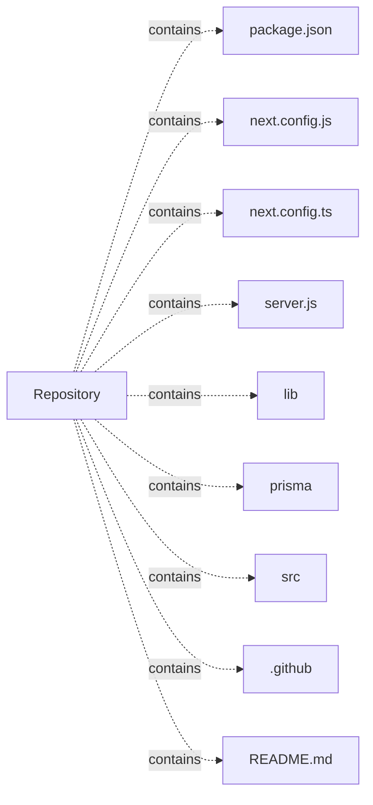

# Engineer-poet-portfolio — project architecture

[README](README.md) · [Interview questions and answers](INTERVIEW_QA.md)

## Purpose and scope

A Next.js portfolio combining DevOps engineering experience and poetry, with authentication, Prisma, and an admin dashboard.

This document describes files and symbols in this checkout. Deployment templates and statements in the original overview are distinguished from a verified running environment.

## Component diagram



For Python repositories, arrows show resolved local imports, not network calls or deployment order. Otherwise the diagram is a repository component map; containment arrows do not assert runtime integration.

## Components and responsibilities

| Component | Responsibility |
| --- | --- |
| [`package.json`](package.json) | Implementation or supporting configuration |
| [`next.config.js`](next.config.js) | Implementation or supporting configuration |
| [`next.config.ts`](next.config.ts) | Implementation or supporting configuration |
| [`server.js`](server.js) | Implementation or supporting configuration |
| [`lib/prisma.ts`](lib/prisma.ts) | Implementation or supporting configuration |
| [`prisma/seed.js`](prisma/seed.js) | Implementation or supporting configuration |
| [`src/app/layout.tsx`](src/app/layout.tsx) | Implementation or supporting configuration |
| [`src/app/page.tsx`](src/app/page.tsx) | Implementation or supporting configuration |
| [`src/app/providers.tsx`](src/app/providers.tsx) | Implementation or supporting configuration |
| [`.github/workflows/ci.yml`](.github/workflows/ci.yml) | GitHub Actions job definitions |
| [`README.md`](README.md) | Project explanations or operating notes |

## JavaScript/TypeScript execution contracts

| Manifest | Script | Command defined by the project |
| --- | --- | --- |
| [`package.json`](package.json) | `dev` | `next dev` |
| [`package.json`](package.json) | `build` | `prisma generate && next build` |
| [`package.json`](package.json) | `start` | `next start` |
| [`package.json`](package.json) | `lint` | `next lint` |
| [`package.json`](package.json) | `create-admin` | `ts-node src/scripts/create-admin.ts` |
| [`package.json`](package.json) | `prisma:generate` | `prisma generate` |
| [`package.json`](package.json) | `prisma:migrate` | `prisma migrate deploy` |
| [`package.json`](package.json) | `postinstall` | `prisma generate` |

Run a script from the directory containing its manifest. Script names are package contracts; their presence does not show that their dependencies are installed or that they pass.

## Data flow and design decisions

### What does `server.js` own

[`server.js`](server.js) defines the module setup. Its imports include `http`, `url`, `next`, `@prisma/client`.

Trace these definitions and imports to explain the module boundary. Relative imports identify project code; package imports should be checked against the nearest manifest.

### What does `next.config.ts` own

[`next.config.ts`](next.config.ts) defines the module setup. Its imports include `next`.

Trace these definitions and imports to explain the module boundary. Relative imports identify project code; package imports should be checked against the nearest manifest.

## Setup and verification

The following commands are derived from the checked-in dependency/test contracts. Execute them from the repository root; the block prepares a local environment, not a cloud deployment.

```bash
npm install
npm run dev
```

No dedicated test files were found in the inspected first-party file inventory. A future implementation should add executable acceptance checks.

Automation definitions: [`.github/workflows/ci.yml`](.github/workflows/ci.yml). Read their triggers and job steps to determine what CI actually runs.

## Operating boundaries and design review

Before turning this checkout into a customer deployment, establish the input contract, data ownership, access controls, failure response, evaluation criteria, and rollback owner. Repository fixtures and unit tests demonstrate local behavior; they do not establish throughput, uptime, compliance, or business impact.

A useful architecture review starts with the linked implementation: identify where input enters, where a decision is made, which state can change, and which external dependency can fail. Add a deployment view only for infrastructure that is actually configured and exercised.
